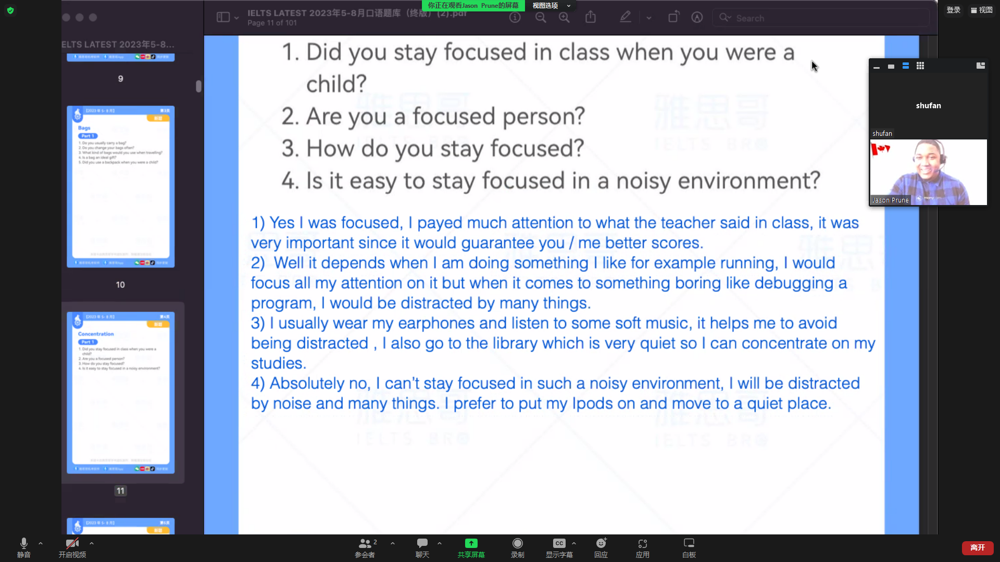
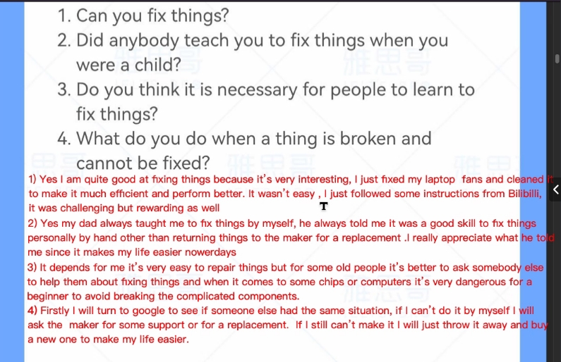
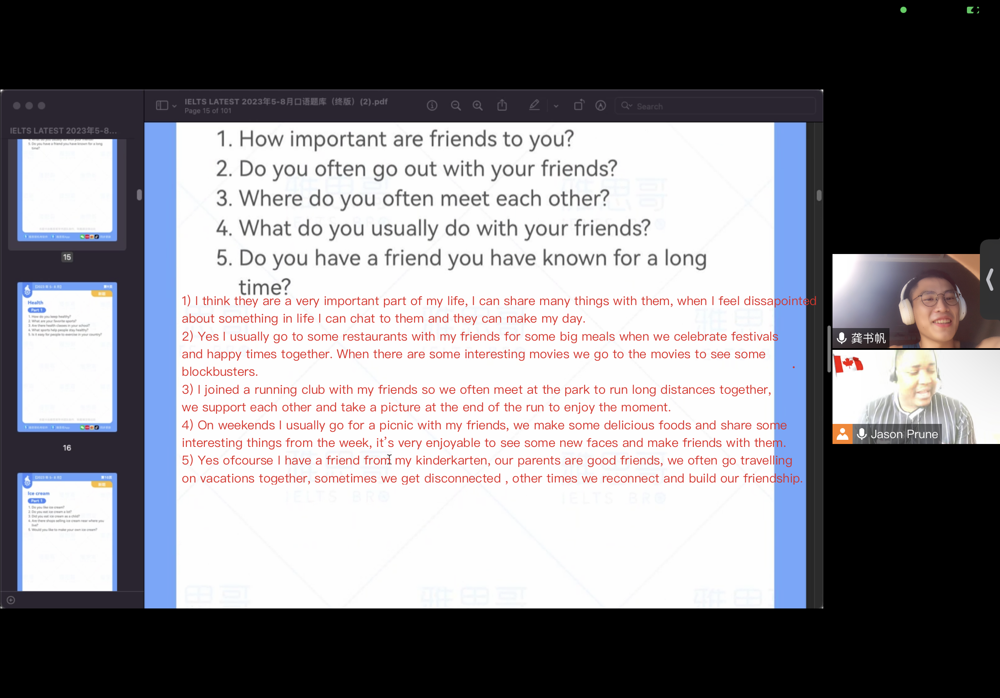

# 8.23
I just took an exam on the 5th of August.
above 30 degree cel

penalty
1. short answers = 15s+ / 2 sentences
2. do not repeat info
3. use the yes/no trick. 

bags
backpack = school bag
shoulder bag
handbag womens bag
purse women's money bag
wallet men's money bag
shopping bag plastic bag paper bag
suitecase = traveling bag
waist bag

- 不需要具体的说，比如protect，就可以protect it，不需要protect it from ...

# 8.24
## concentration

focus
pay attention to

1. drink coffee energized
2. sleep early 
3. quiet
4. switch off ipad / phones
5. ear pods 

**ask extra questions**

## day off

**repeat** 

afterwards lastly

## dream and ambition

could you please repeat

## Fix things

# 8.25
friends

health

diet
exer
nervous
i

ice cream
i asked
body

language
nondialect
take off t-shirts

teachers 30

# 8.26
patient
leave me some exercises

city

firms=> air clean, traffic cong-> big city old-ancient buildings-> modern skyscrapers

wild animal

Part2
**story**
similar structure
WH Questions where what who which when why how

1.5 min quickly continue talking. Oh, you know ... 
less than 2 min

Supervisor 30s
 hardworking talented thoughtful
teach ohter
inspire
if you 

on themselves 
solve by themselves

family reunion

Chinese New Year
family reunion watch TV programs talk about whole years life
family members mother father grandparents
precious time

for shi

# 8.27

book
Docter Daniel's running formular
training exercise methods and sports lives of famous runners
score table
every year

e-book

famous person
Eluid Kipchoge
most successful marathon runner ever time
won for 8 years and got 2 gold medals in Olympics
milk boy

goat
no human is limited

inspire

young child
niece 7 years old
in this Chinese New Year. my Parents went to the supermarket, and 
played computer no interest
let her ride a bike
children. not childrens
ran 

I missed a test just because I forgot to apply for it.
csp test
in august

house
cottage in countryside of Henan, which is my hometown.
My family members
farms
used to see them a few times on train travels

adventure
UTMB famous
chamonix France
Maybe with my friends, who also studied in  live in Zurich
pilgrim

mountain stone-monkey in my hometown I 've neveer take a trail running here so I started to run in the mountain.
But I don't have a map.
evening
last summer

scared
I called my

get connection

with my parents
They drove me to university
My mother and father drove  in turn

We drove into the dormitory

I wish I could spend more time with my parents, since 

all along the way
took some photos, sightseeings, ate in restaurant, talked each other, checked into hotels

breaking 2 tell a story about Kipchoge, who is the greatest mar run of all the time , tried to break the world record but failed
recom

water sport: fishing swimming surfing diving sailing
swiming in open water. 
east lake, near my university
it's really hard
always see many when I am running. triathlon

5 kilimeters runing race
first TV 2008 Beijing Olympic Games
since then, I started to run . also watch some games at 2 am
they are vary cool

Past tense

expensive sports car

I am a student now, maybe I will spend more than a several years to do so.

She was very cool, 
but to have a baby
I think she is a good mother And I want to compesent 

made 

zhuozheng garden. 后面带一个garden
I've been there twice, fir and seco
taking photos, listen to guides , children chasing each other
I don't think it is a good place to relax, since it is always crowded
quite famous for architecture and design, which is very unique in China
Ancient people combine elements 

brother
Zurich which is a city in Switzerland, he said he can ride a bike from German to Switzerland everyday cool
study in a new university
If you want to learn more, you can 

page 33

# 8.28

There was a sudden fall of temperature, but I didn't wear enough clothes. 

happy experience in your childhood
it was when I was about 10 years old, I went to an exposition named the window of the world in Shenzhen 
parents and my aunt
we see many famous buildings and architectures from all over the world, like pyramids, Eiffel Tower, and the statue of liberty
I really like the pyramid because it's very mysterious and I've never seen it before. 

wee saw
they(pyramid) are very
archaeologists

playing a computer game named Broforce
it's a battle game, and you can play with your friends
I like to play it in my home or in my friends' home

Zurich
the next year, because I am going to study in a new university
fly there, because it's realy far 
see some run with 

blue running vest 
i got it when I ran a marathon in less than 3 hours, sent  
identified as a elite runner
confidence

temporary store

a shop in my university
hotmax, foods that near the deeadline
young students
successful

照顾的英语是take care of

students graduate from senior high schools
study life
nervous introverted, continue-> confidence
embarrasing time,  talk me a lesson that if you prepare well, you will be confident

sports analyst
I like running and I find it very interesting that my watch could predict a score about my races

smart watch
log your running data listen to music guide yourself in a trail running
world recod holder
learning cureve

